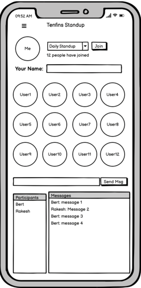

# flutter_standup

Standup is a simple Clubhouse like app, It is designed to be very simple and easy to use.
It will use a backend to handle the complex voice and text messaging, 
Your task will be to create the UI which can be connected to a backend.

### Task 1. Create this UI

When a user runs the app they should be able to upload there picture, set their name and select a channel to join.
The app will show the images of the other people in the channel.

### Task 2. Use Agora to add Messaging and Audio Calling feature
ref: https://pub.dev/packages/agora_rtc_engine

### Button Actions:

### "Join"
When the join button is clicked, the user is added to the room. The backend (agora)  is notified that a new user has joined the room. The button changes to "Leave" so that the user can leave the room. If the "Leave button is clicked, the backend is notified that the user has left the room.

### "Send Msg"
When the Send Msg button is clicked, the text (if present) in the text box to the left of the button is sent to the backend. If the textbox is empty, do not send a message. The message is then added to the list of messages. Each message has the form "user: message". When the message is sent, the textbox is cleared for the next message to be sent.

#### Note: User Should not be able to join the room with empty name.

### FAQ
### 1. How many messages will be visible in chat?
There should be no limit for messages. Messages box needs to scroll.

### 2. How many users can there be?
No limit, but typically less than 12.
12 user images should fit on the screen
but if more this should be scrollable.

### 3. How dropdown will work?
Dropdown will be a list of channels.
channels will be:
1. Standup
2. Bugs
3. Release

user can join any one of this channels
